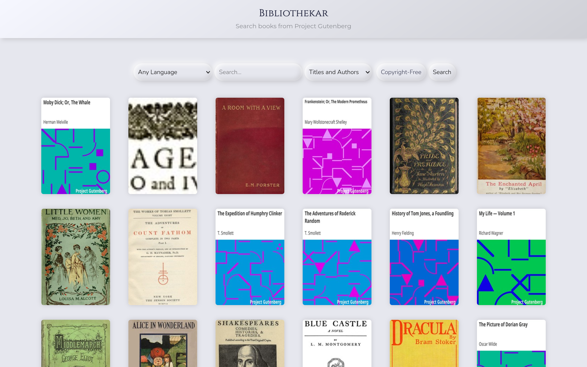
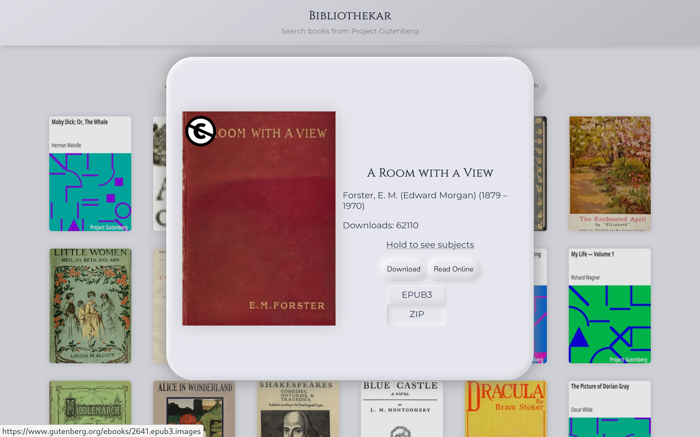
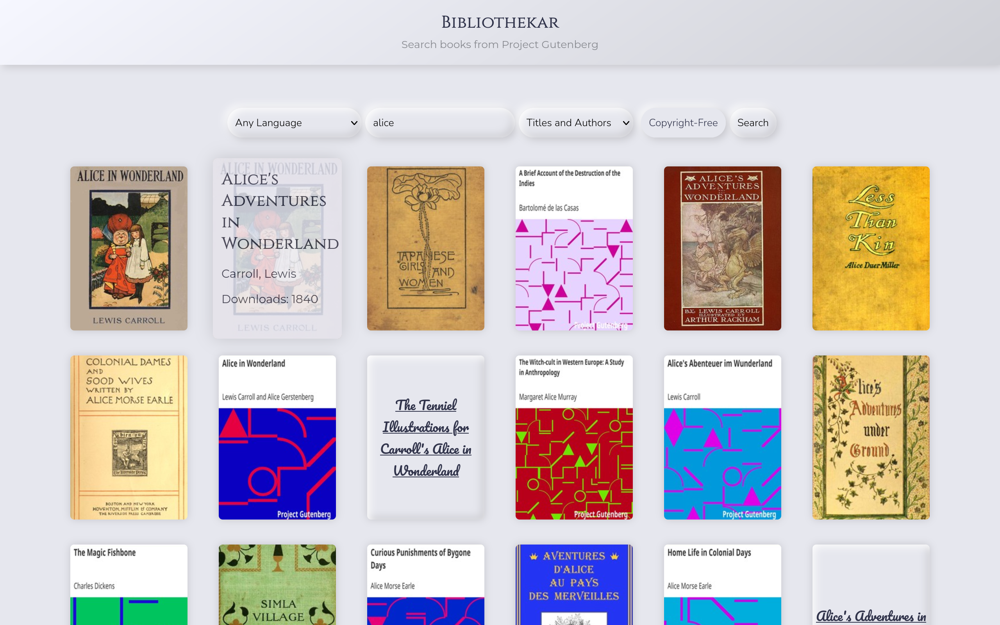

#  Bibliothekar

Use it: https://iigaz.github.io/bibliothekar/

---

Bibliothekar is a tool for searching books on [Project Gutenberg](https://www.gutenberg.org/). Under the hood, it uses [Gutendex](https://gutendex.com/) API. Also kinda inspired by [Myne for Android](https://github.com/Pool-Of-Tears/Myne).

It was made as an exercise in HTML/CSS, and there isn't much more to it. I just wanted to try some "trendy" and "modern" design, and decided to give [neomorphism](https://en.wikipedia.org/wiki/Neumorphism) a go.

## Screenshots

